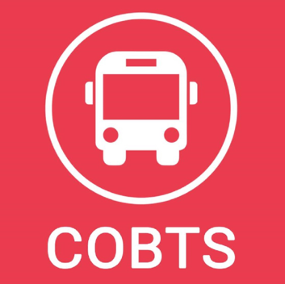
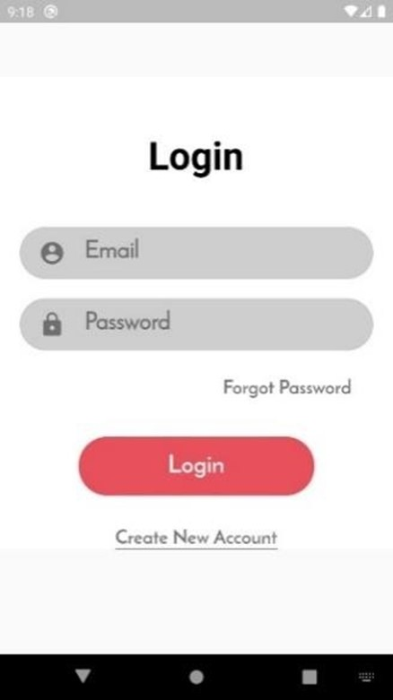
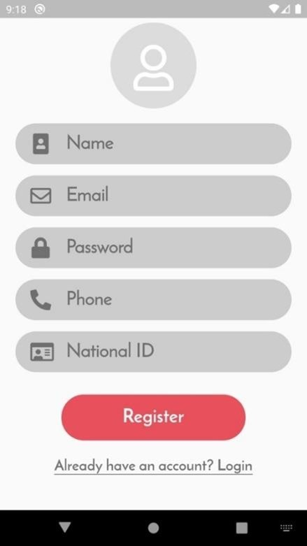
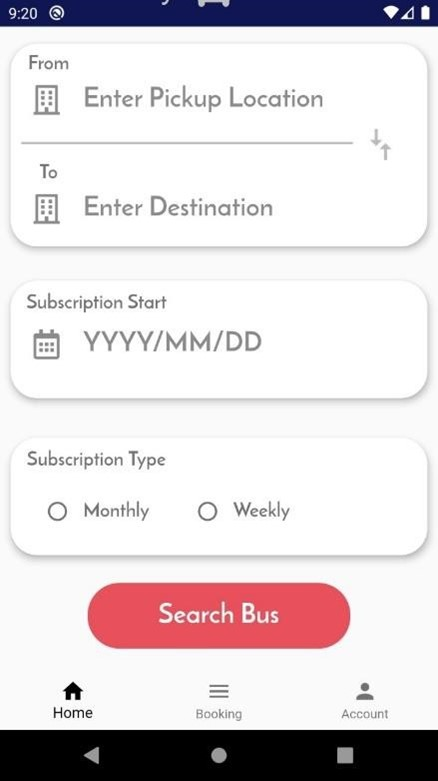
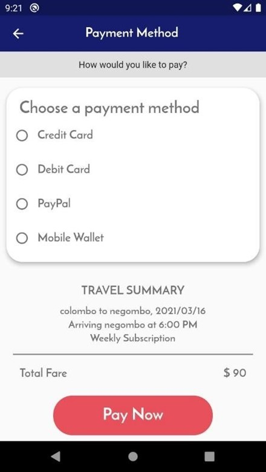
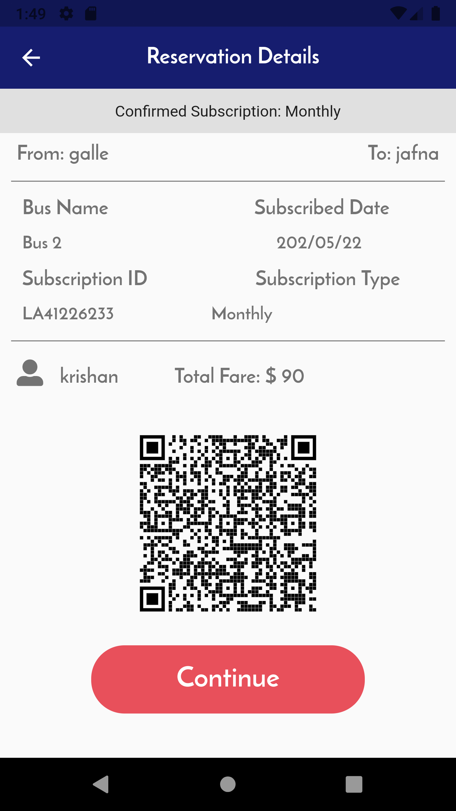
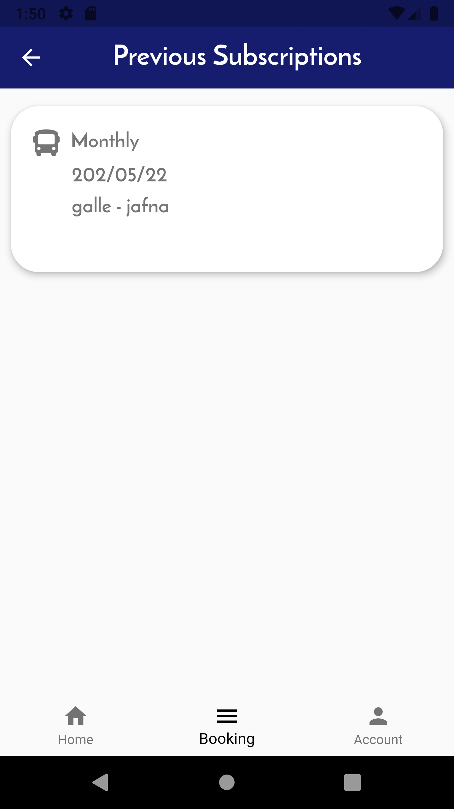
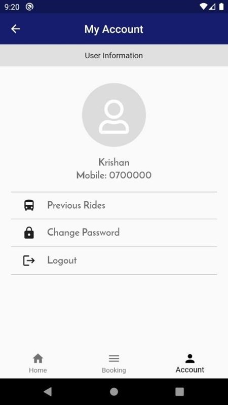
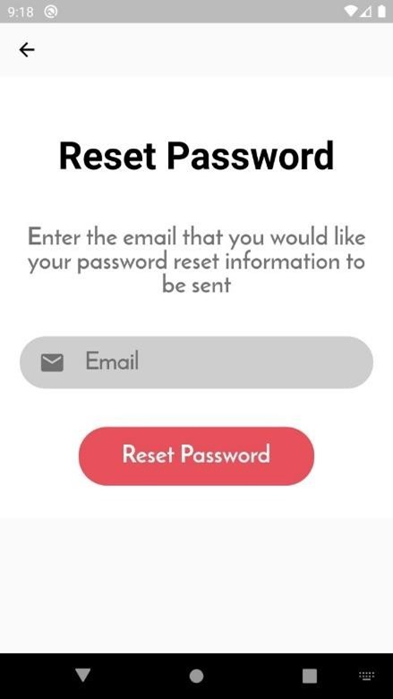
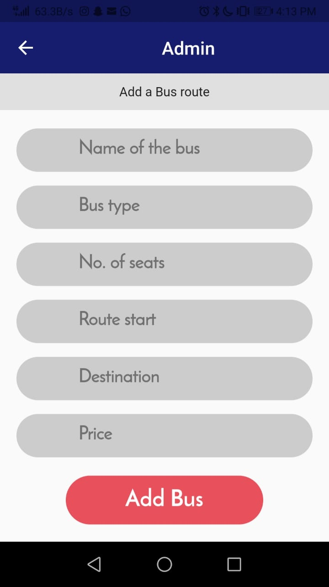

# Ceylon Online Bus Ticketing System

> Mobile Application To Make Daily Commuter's Life Simpler.

---

### Table of Contents
You're sections headers will be used to reference location of destination.

- [Description](#description)
- [Abstract](#abstract)
- [License](#license)

---

## Description

"Flutter application to make transactions between the bus conductor and the passenger easier by providing a QR code. The QR code contains the passenger details along with the bus route and wheather the passenger subscribed to a montly or weekly package"

## Abstract

The Ceylon Online Bus Ticketing System is a mobile app developed with the 
ambitious motive of making public transportation more easier and hassle – free for the regular passengers. The motive of the COBTS application is to replace the simple, yet tedious sequence of actions included in public transportation and make it more user friendly and easy. 
The COBTS is a simple downloadable application which allows users to create and manage a user account through which they can navigate and subscribe to one or multiple bus routes pertaining to their requirement and subscribe on a monthly basis. After the subscription, the user will receive a QR code, which will be scanned by the bus conductor upon entering the bus which will determine and warrant that the user has paid and renewed the monthly subscription or not. Additionally, the user can easily search and navigate routes according to how often they were searched for in that certain location with the help of location enabling. A timetable on the estimated arrival and departure of buses along the selected routes will also be provided for the passenger as an additional facility. 

## Overview

#### Login Screen

#### Registeration Screen

#### Destination Selection Screen

#### Payment Method Screen

#### Reservation Details Screen

#### Previous Subscriptions Screen

#### My account Screen

#### Reset Password Screen

#### Admin Screen

---

## Technologies

- Flutter
- Dart
- Firebase
- Android Studio

---

## References

- Instagram - [@krishan_shanuka](https://instagram.com/krishan_shanuka?utm_medium=copy_link)

## License

MIT License

Copyright (c) [2021] [Krishan Shanuka]

Permission is hereby granted, free of charge, to any person obtaining a copy
of this software and associated documentation files (the "Software"), to deal
in the Software without restriction, including without limitation the rights
to use, copy, modify, merge, publish, distribute, sublicense, and/or sell
copies of the Software, and to permit persons to whom the Software is
furnished to do so, subject to the following conditions:

The above copyright notice and this permission notice shall be included in all
copies or substantial portions of the Software.

THE SOFTWARE IS PROVIDED "AS IS", WITHOUT WARRANTY OF ANY KIND, EXPRESS OR
IMPLIED, INCLUDING BUT NOT LIMITED TO THE WARRANTIES OF MERCHANTABILITY,
FITNESS FOR A PARTICULAR PURPOSE AND NONINFRINGEMENT. IN NO EVENT SHALL THE
AUTHORS OR COPYRIGHT HOLDERS BE LIABLE FOR ANY CLAIM, DAMAGES OR OTHER
LIABILITY, WHETHER IN AN ACTION OF CONTRACT, TORT OR OTHERWISE, ARISING FROM,
OUT OF OR IN CONNECTION WITH THE SOFTWARE OR THE USE OR OTHER DEALINGS IN THE
SOFTWARE.

---

